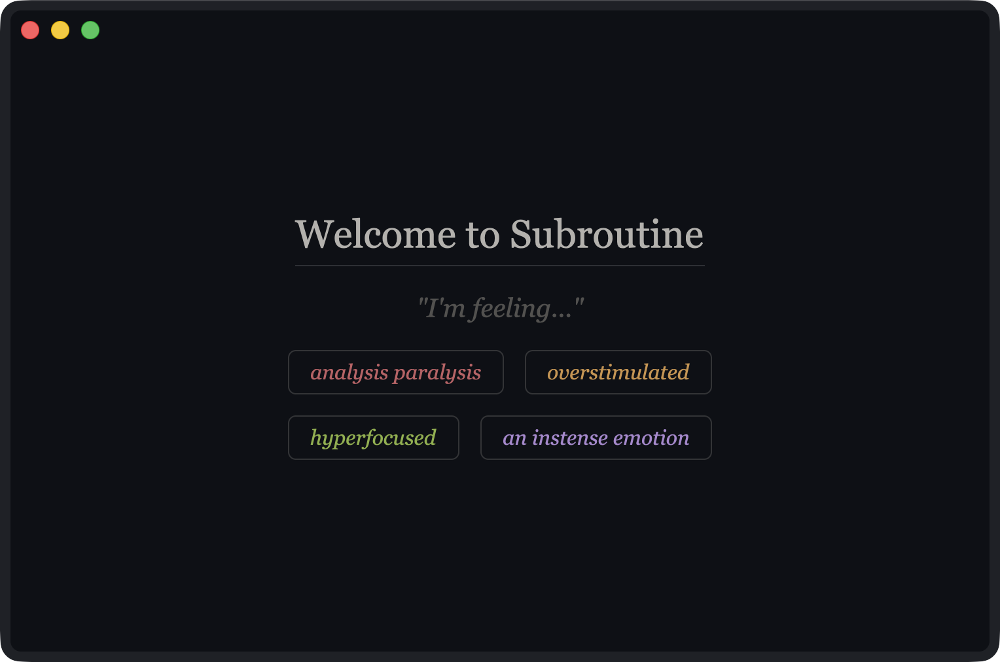

  

---

*"Externalize your executive function. We can't all be multithreaded."*

---

Subroutine is a context-aware action recommender and executive function prosthetic built for monotropic minds and those who struggle with task initiation, transitions, or executive dysfunction in general. Rather than a traditional task manager, it adapts to your current mental state and context — surfacing the right actions at the right time, minimizing decision fatigue, and smoothing over the rough edges of planning and transitions. It's designed to be a trusted partner in your daily life, helping you get things done without the overhead of constant decision-making.

---

> ⚠️ This project is in early development. Nothing is stable, and large parts of the design are still being built.
